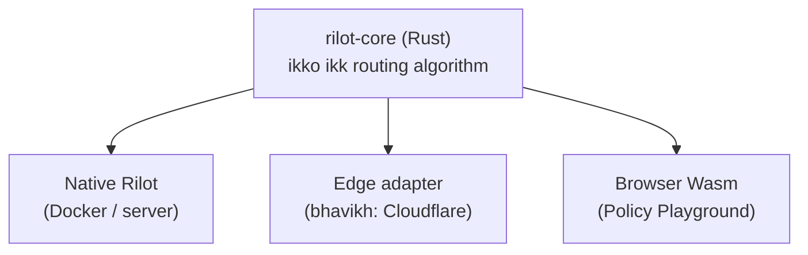
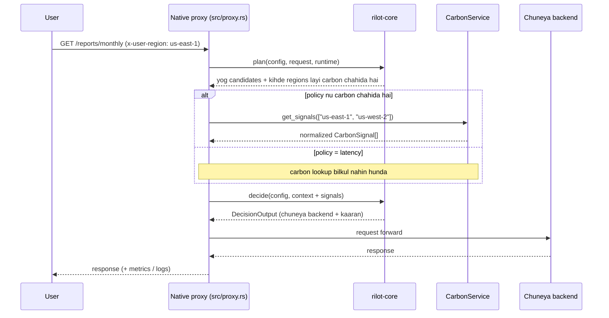
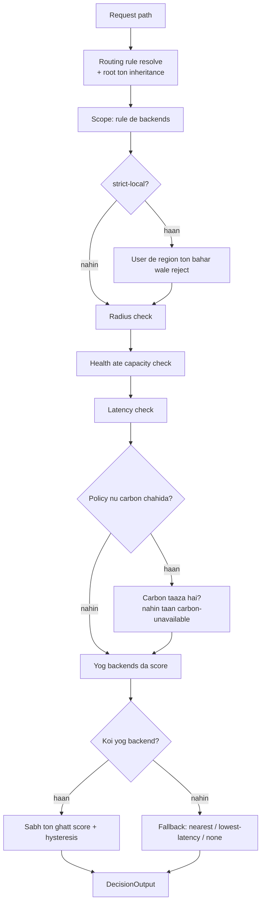
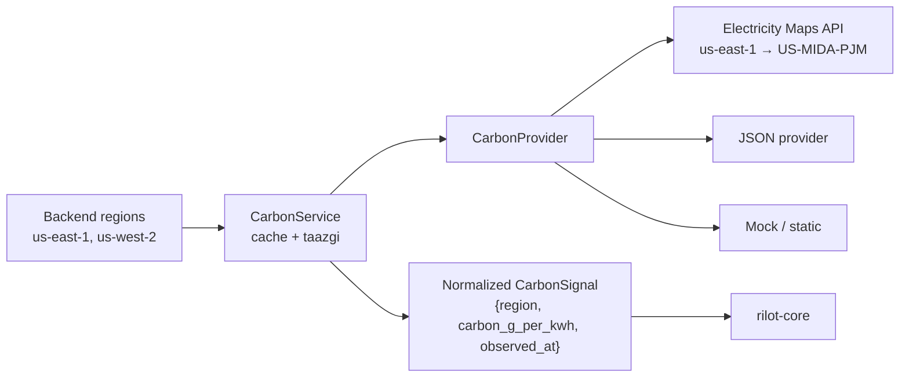
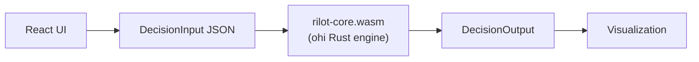
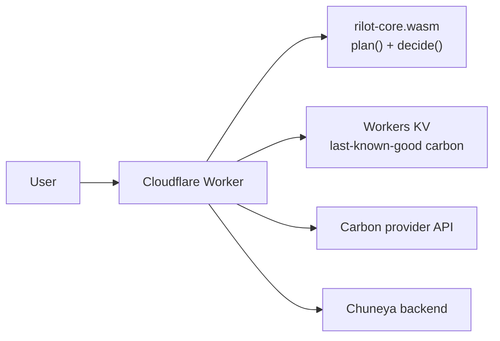

# Rilot kiven kamm karda hai (Punjabi guide)

Eh guide samjhaundi hai ki Rilot ki hai, is de hisse kihde han, ate ikk request aun ton lai ke backend chune jaan tak poora flow kiven chalda hai.

Code, config keys ate technical shabad (jiven `backend`, `policy`, `radius_km`) jaan-bujh ke English vich rakhe gaye han, taan jo tusin inhan nu sidha config ate code vich labh sako.

---

## 1. Rilot ki hai?

Rilot ikk **carbon-aware reverse proxy** hai. Jadon koi user request bhejda hai, taan Rilot faisla karda hai ki oh request kihde backend (server / region) nu bhejni hai. Eh faisla tinn gallan nu tol ke kita janda hai:

- **Latency**: backend kinni jaldi jawab devega.
- **Carbon intensity**: us region di bijli kinni saaf hai (gCO2/kWh).
- **Reliability**: backend vich errors kinniyan aa rahiyan han.

Naal hi kujh hadd-bandiyan (guardrails) vi laagu hundiyan han. Udaharan layi, user ton vadh ton vadh doori (`radius_km`), taan jo saaf par bahut door wala region galti naal na chuneya jave.

---

## 2. Sabh ton zaroori niyam: ikko ikk routing engine

Rilot vich faisla karan wala algorithm **sirf ikk thaan** hai: `crates/rilot-core`.



- **Native Rilot** (`src/`): asal HTTP proxy, jo Docker vich chalda hai.
- **Policy Playground** (`examples/policy-playground`): eh ohi `rilot-core` hai, WebAssembly vich compile karke browser vich chalaya janda hai.
- **Edge adapter**: bhavikh vich Cloudflare varge edge platform layi.

Baaki sabh hisse sirf **adapter** han. Oh data ikattha karke core nu dinde han ate core de faisle utte amal karde han, par aap koi routing faisla nahin karde. Ise karke ikko input den utte native ate browser dovaan vich natija bilkul ikko aunda hai.

`rilot-core` poori tarah **pure** hai:

- Na network, na HTTP, na file system, na environment variables.
- Apni ghadi (clock) vi nahin padhda; samaan (`now`) bahron input vajon aunda hai.
- Is karke har faisla duhrayea ja sakda hai (deterministic), jo research layi bahut zaroori hai.

---

## 3. Config kiven likhiye

Ikk aam config:

```json
{
  "carbon": { "provider": "electricitymap", "max_age_seconds": 300 },

  "backends": [
    { "id": "east", "region": "us-east-1", "url": "https://east.example.com" },
    { "id": "west", "region": "us-west-2", "url": "https://west.example.com" }
  ],

  "policy": "balanced",
  "radius_km": 2000,
  "fallback": "nearest",

  "routing_rules": [
    { "path": "/checkout/*", "policy": "latency", "radius_km": 800 }
  ]
}
```

| Key | Matlab |
| --- | --- |
| `backends` | Oh servers jinhan vichon chunna hai. Har ikk da `id`, `region` ate `url`. |
| `policy` | `latency` (sabh ton tez), `balanced` (santulan), jaan `carbon` (sabh ton saaf bijli). |
| `radius_km` | User ton backend di vadh ton vadh doori. |
| `fallback` | Je koi backend yog na hove taan ki karna hai: `nearest`, `lowest-latency`, jaan `none`. |
| `routing_rules` | Kise khaas path layi vakhriyan settings. |

### Routing rules ate inheritance (virasat)

Koi rule jo value nahin dassda, oh **root config ton lai layi jandi hai**. Uparli config vich `/checkout/pay` layi natija eh hovega:

```text
Matched rule:  /checkout/*
policy   = latency      (rule ton)
radius   = 800 km       (rule ton)
fallback = nearest      (root ton inherited)
backends = east, west   (root ton inherited)
```

Rule chunan da tareeka:

- `/checkout/*` naal `/checkout` ate us de hethle saare paths match hunde han.
- `*` ton bina path da matlab hai bilkul ohi path (exact match).
- Je kayi rules match hon, taan **sabh ton specific rule jittda hai**: exact match pehlan, phir lamma prefix.
- Je koi rule match na hove, taan root config laagu hundi hai.

Purana `proxies` wala config format vi ajje chalda hai. Rilot usnu load karde samein aap-muhaare navein format vich badal lainda hai ([config-reference.md](config-reference.md) vekho).

---

## 4. Ikk request da poora flow (Native Rilot)



Kadam-dar-kadam:

1. **Request aundi hai.** Proxy path, `x-user-region` (jaan `x-user-lat` / `x-user-lon`) ate `x-rilot-*` headers padhda hai.
2. **Runtime data ikattha hunda hai.** Har backend da error rate, in-flight requests, ate traffic share.
3. **`plan()`**: core oh saare checks karda hai jinhan layi carbon di lorh nahin (rule, radius, health, latency), ate dassda hai ki kihde regions da carbon data chahida hai.
4. **Carbon sirf lorhinde regions layi laya janda hai.** Jo backends radius ton bahar han, unhan da carbon mangeya hi nahin janda. `latency` policy layi koi carbon lookup hunda hi nahin.
5. **`decide()`**: core carbon di taazgi jaanchda hai, score karda hai, hysteresis ate fallback laagu karda hai.
6. **Forward**: request chune gaye backend de `url` utte bheji jandi hai.
7. **Metrics ate logs**: `/metrics` (Prometheus) ate structured decision logs update hunde han.

---

## 5. Core andar faisla kiven hunda hai



### Har backend di haalat

Core har backend baare saaf dassda hai ki oh chuneya kyon gaya jaan kyon nahin:

| Status | Matlab |
| --- | --- |
| `eligible` | Saare checks paas kite |
| `outside-radius` | User ton `radius_km` naalon vadh door |
| `region-constraint` | Strict-local route, ate backend user de region ton bahar hai |
| `health-constraint` | Backend unhealthy hai jaan us da error rate bahut vadh hai |
| `capacity-constraint` | Bahut saariyan requests pehlan hi chal rahiyan han |
| `latency-constraint` | Bahut hauli hai |
| `carbon-unavailable` | Carbon data nahin hai, jaan 300 second ton purana hai |
| `fallback` | Koi backend yog nahin si, is layi fallback raahin chuneya gaya |

Is naal hamesha samajh aa janda hai ki **ikk saaf (cleaner) backend kyon nahin chuneya gaya**.

### Scoring

Har metric nu yog backends vichon sabh ton vaddi value naal bhaag kita janda hai (0 ton 1), phir weight naal guna karke jodeya janda hai. **Jis da score sabh ton ghatt, oh jittda hai.**

| Policy | Carbon | Latency | Reliability |
| --- | --- | --- | --- |
| `latency` | 0 | 1.00 | 0 |
| `balanced` | 0.50 | 0.35 | 0.15 |
| `carbon` | 0.70 | 0.20 | 0.10 |

### Hysteresis (vaar-vaar badlan ton bachaa)

Je navaan backend purane naalon bahut thodha hi behtar hai (`hysteresis_delta` ton ghatt farak), taan traffic purane backend utte hi rehnda hai. Is naal traffic do lagbhag-barabar regions vich lagataar jhoolda (flapping) nahin.

---

## 6. Carbon data kithon aunda hai



- Rilot hamesha **backend de region** di bhasha bolda hai (`us-east-1`), user de region di nahin.
- Electricity Maps da zone id (jiven `US-MIDA-PJM`) sirf provider de andar rehnda hai. Core nu is baare kade pata nahin lagda.
- `CarbonService` cache sambhaldi hai:
  - Taaza signal hove taan ohi varteya janda hai.
  - Nahin taan provider nu puchheya janda hai.
  - Provider fail ho jave taan pichhla value (last-known-good) varteya janda hai, par sirf je oh `max_age_seconds` (default 300) ton purana na hove.
- Je carbon na mile, taan oh backend `carbon-unavailable` ho janda hai ate aam fallback niyam laagu hunde han.
- Generic JSON provider da format:

```json
{
  "signals": [
    { "region": "us-east-1", "carbon_g_per_kwh": 245, "observed_at": "2026-09-18T20:00:00Z" }
  ]
}
```

API key nu config di bajaaye `RILOT_ELECTRICITYMAP_API_KEY` environment variable vich rakho.

### Carbon layer ikk vakhri, sanjhi layer hai

Eh sara kamm na core da hissa hai, na kise adapter da — eh vakhri layer hai:

| Cheez | Kamm |
| --- | --- |
| `CarbonProvider` | data kithon aunda hai (electricitymap, json, static, jaan tuhada naya source) |
| `CarbonStore` | data kithe cache hunda hai (memory, Workers KV, …) |
| `CarbonService` | sirf ehi freshness / refresh / fallback de niyam janda hai |

Tinn pakke niyam: **provider kade cache nahin karda**, **store kade fetch nahin karda**, ate **provider de apne zone ids kade bahar nahin jande**.

**Niyam sirf ikko thaan han — Rust vich:** `crates/rilot-carbon-policy`. Eh pure crate hai (koi I/O nahin) ate wasm vich vi chalda hai. Do "service" classes (`crates/rilot-carbon` native layi, `packages/rilot-carbon` Worker layi) sirf I/O karde han: store padhna, provider nu call karna, wapas likhna.

```text
store padho ─▶ rilot_carbon_plan()  ─▶ { serve, fetch, refresh }   (Rust)
                                            │
                                   provider fetch (host da kamm)
                                            │
                      rilot_carbon_merge() ◀┘                       (Rust)
                             └─▶ { signals, store_writes, stale_served }
```

Worker vich TypeScript is layi hai kyunki uthe `reqwest`/`tokio` nahin chalde — par faisle Rust hi karda hai. `fixtures/carbon/*.json` dovaan pase chalde han, is layi wiring vi check hundi rehndi hai.

### Naya carbon source kiven add karna hai

1. `CarbonProvider` interface implement karo (ikk `fetch(regions)` method).
2. Region → apne source de id da mapping **usse file de andar** rakho.
3. Registry vich register karo: `registerProvider('watttime', ...)` (TS) jaan `src/carbon.rs` vich wire karo (Rust).
4. Naya behaviour hove taan `fixtures/carbon/` vich ikk fixture jodo.

Config vich koi schema badlaav nahin chahida — provider-specific settings `carbon.options` vich jandiyan han:

```json
{ "carbon": { "provider": "watttime", "options": { "areas": { "us-east-1": "PJM_ROANOKE" } } } }
```

Poori jaankari: [docs/carbon-layer.md](carbon-layer.md).

---

## 7. Tinn udaharnaan

Mann lao user `us-east-1` (Virginia) vich hai, ate backends eh han: `east` (us-east-1, 390 g), `ohio` (us-east-2, 470 g), `west` (us-west-2, 90 g), ate `stockholm` (eu-north-1, 25 g).

| Request | Laagu settings | Natija | Kyon |
| --- | --- | --- | --- |
| `/checkout/pay` | `latency`, 800 km (rule) | **east** | Sabh ton tez hai. `west` ate `stockholm` radius ton bahar han. Carbon da lookup hi nahin hunda. |
| `/recommendations/user/123` | `balanced`, 2000 km (root) | **east** | Koi rule match nahin hunda, is layi root laagu hunda hai. Saaf `west` 2000 km ton bahar hai. |
| `/reports/monthly` | `carbon`, 5000 km (rule) | **west** | Vadde radius vich saaf `west` aa janda hai. `stockholm` hor vi saaf hai par 5000 km ton bahar hai. |

Ehi tinn udaharnaan Policy Playground vich presets vajon maujood han.

---

## 8. Policy Playground (browser vich)



- Playground da apna koi routing algorithm nahin hai. Saare natije `rilot-core.wasm` ton aunde han.
- **Normal view** vich eh dikhda hai: path, user region, matched rule, policy, radius, fallback, carbon status, candidates ate antim faisla.
- **Research / Advanced view** vich weights, guardrails, hysteresis, score breakdown ate decision trace vi dikhde han.
- "Edit the full config as JSON" vich tusin native Rilot wali poori config paste kar sakde ho.
- Carbon data simulated hai, is layi koi API key nahin chahidi ate eh GitHub Pages utte static site vajon chalda hai.

Chalaun layi:

```bash
rustup target add wasm32-unknown-unknown
cd examples/policy-playground
npm install
npm run dev
```

---

## 9. Docker naal chalauna

```bash
# Image banao
docker build -t rilot .

# Default config (docker/config.json) naal chalao
docker run -p 8080:8080 rilot

# Apni config naal chalao
docker run -p 8080:8080 \
  -v "$PWD/my-config.json:/app/config.json:ro" \
  -e RILOT_ELECTRICITYMAP_API_KEY=... \
  rilot
```

Default config mandi hai ki `examples/node-apps` wale simulators tuhadi machine utte ports 5601 ate 5602 utte chal rahe han (`host.docker.internal`). Linux utte `docker run` naal `--add-host=host.docker.internal:host-gateway` jodo.

Poora research setup (Rilot + simulators + Prometheus):

```bash
cd research-kit
docker compose up --build
```

Kamm de environment variables:

| Variable | Kamm |
| --- | --- |
| `RILOT_HOST`, `RILOT_PORT` | Kis address ate port utte sunna hai (default `0.0.0.0:8080`) |
| `RILOT_EXPOSE_RESEARCH_HEADERS=true` | Response vich `x-rilot-decision-reason` varge debug headers |
| `RILOT_ELECTRICITYMAP_API_KEY` | Electricity Maps di API key |
| `RUST_LOG` | Log level (`info`, `debug`) |

Jaanch karan layi:

```bash
curl -i -H 'x-user-region: us-east-1' http://localhost:8080/checkout/pay
curl http://localhost:8080/metrics
```

---

## 10. Cloudflare Worker (edge te chalauna)

`adapters/cloudflare` ikk Cloudflare Worker hai jo **ohi `rilot-core`** WebAssembly vajon chalaunda hai. Yaani edge da faisla ate native Rilot da faisla bilkul ikko jeha hunda hai.



Worker sirf transport da kamm karda hai:

- Cloudflare ton user di location (`cf.latitude` / `cf.longitude`) laina — is layi radius apne aap kamm karda hai.
- Carbon signals laina: pehlan isolate di memory, phir Workers KV (last-known-good), phir provider.
- Chune gaye backend nu request forward karna ate `x-rilot-*` headers laana.

Routing da koi vi faisla Worker vich nahin hunda — sabh kujh `rilot-core` karda hai.

### Local test

```bash
rustup target add wasm32-unknown-unknown
cd adapters/cloudflare
npm install            # npm 10.9.x utte: npm install --legacy-peer-deps
npm run dev            # http://127.0.0.1:8787

curl http://127.0.0.1:8787/__rilot/health
curl "http://127.0.0.1:8787/__rilot/decision?path=/checkout/pay"
```

`/__rilot/decision` poora faisla JSON vich dassda hai (matched rule, har candidate di doori, latency, carbon status ate reject karan da kaaran) — asli backends ton bina vi test ho janda hai.

### Deploy

```bash
npx wrangler login

# KV namespace (last-known-good carbon signals)
npx wrangler kv namespace create CARBON
npx wrangler kv namespace create CARBON --preview
# donon ids wrangler.toml de [[kv_namespaces]] vich paste karo

# Electricity Maps di key (vars vich kade na rakho)
npx wrangler secret put ELECTRICITYMAP_API_KEY

# apne backends layi wrangler.toml vich RILOT_CONFIG badlo, phir:
npm run deploy
```

Deploy ton baad:

```bash
curl https://rilot-edge.<tuhada-subdomain>.workers.dev/__rilot/health
curl "https://rilot-edge.<tuhada-subdomain>.workers.dev/__rilot/decision?path=/reports/monthly"
```

### Dhyan rakhan wali gallan

- **Hysteresis sirf ikk isolate tak** hai, kyunki Cloudflare kayi isolates chalaunda hai. Global stickiness layi Durable Object chahida hovega.
- **Defer (time shifting) edge te sleep nahin karda**; sirf `x-rilot-defer-seconds` header dissda hai.
- **`/metrics` edge te nahin hai**; `wrangler tail` jaan Workers Analytics varto.

Poori jaankari: [adapters/cloudflare/README.md](../adapters/cloudflare/README.md).

---

## 11. Test ate iksaarta (consistency)

`fixtures/decisions/` vich saanjhe test cases han, jiven balanced, carbon-first, latency-first, radius rejection, fallback, missing carbon, hysteresis, ate rule inheritance. Ehi files tinn thaavan utte check hundiyan han:

```bash
cargo test --workspace                                  # rilot-core + native Rilot
node scripts/check-wasm-fixtures.mjs                     # compiled Wasm
cd examples/policy-playground && npm test                # browser adapter
cd adapters/cloudflare && npm test                       # Cloudflare Worker (workerd)
```

Je tinnan vichon kite vi natija vakhra aave, taan CI fail ho janda hai.

---

## 12. Shabdavali

| Shabad | Matlab |
| --- | --- |
| Backend | Oh server jis nu request bheji jandi hai |
| Region | Backend di thaan, jiven `us-east-1` |
| Carbon intensity | Bijli banaun vich nikli CO2 (gCO2/kWh); jinni ghatt, oni saaf |
| Radius | User ton backend di vadh ton vadh manzoor doori |
| Fallback | Jadon koi backend yog na hove taan apnaya jaan wala tareeka |
| Hysteresis | Chhote faide layi backend na badlan da niyam |
| Adapter | Oh hissa jo core nu data dinda hai ate us de faisle utte amal karda hai |
| Wasm (WebAssembly) | Rust code nu browser vich chalaun da tareeka |

Chalaun de poore steps: [running.pa.md](running.pa.md).

Hor vistaar layi (English vich): [architecture.md](architecture.md), [runtime-behavior.md](runtime-behavior.md), [config-reference.md](config-reference.md).
